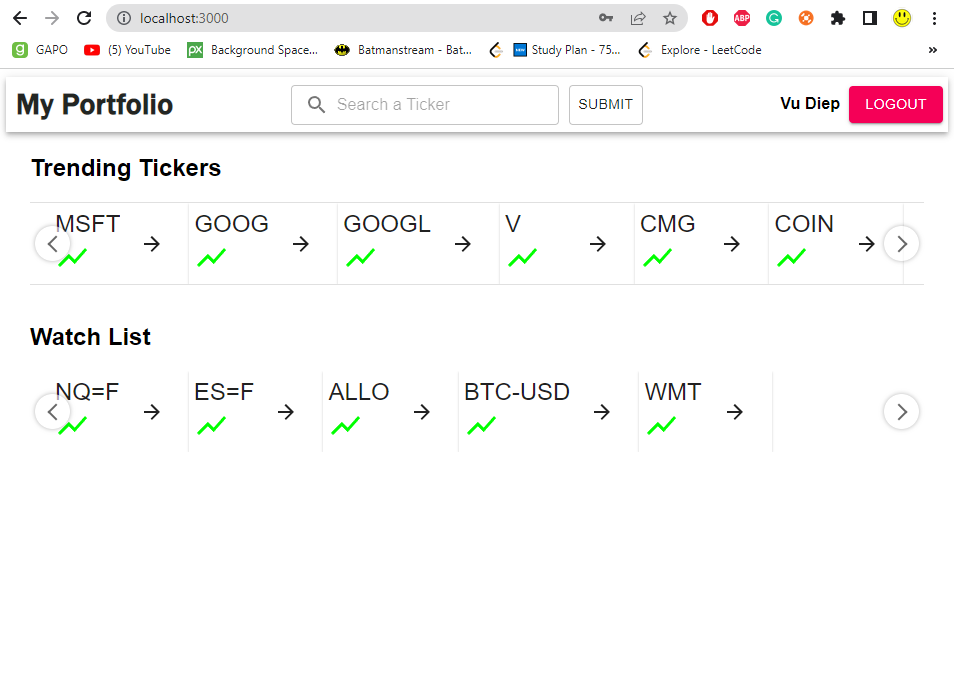

<a name="readme-top"></a>

<!-- PROJECT LOGO -->
<br />
<div>
<h1 align="center">Stock Portfolio Management</h1>

  <p align="center" height="600">
A commercial portfolio management system requires numerous complex features to help organizations maintain and manage their financial assets. Fetching real time data from yahoo finance API, Bfinance (Still working on more backtesting features)
    <br />
 


<!-- ABOUT THE PROJECT -->
## About The Project


<br/>
<br/>
<p>Visit the fully deployed project</p>
<a href='https://main.d25n7xn7e49jra.amplifyapp.com/'>Click here</a>

<p align="right">(<a href="#readme-top">back to top</a>)</p>


### Built With

* [![Next][Next.js]][Next-url]
* [![express][express]][express-url]
* [![Node.js][Node.js]][Node.js-url]
* [![mongoDB][mongoDB]][mongodb-url]


<p align="right">(<a href="#readme-top">back to top</a>)</p>


<!-- GETTING STARTED -->
## Getting Started

This is an example of how you may give instructions on setting up your project locally.
To get a local copy up and running follow these simple example steps.

### Prerequisites

This is an example of how to list things you need to use the software and how to install them.
* npm
  ```sh
  npm install npm@latest -g
  ```

### Installation

1. Clone the repo
   ```sh
   git clone https://github.com/vudiep411/PorfolioManagement.git
   ```
2. Install NPM packages for client
   ```sh
   cd ./client
   npm install
   npm start
   ```
3. Install NPM packages for server on a new terminal
   ```sh
   cd ./server
   npm install
   npm run dev
   ```


 
  <br/>
<p><b>Note:</b></p>
<ul>
<li>Yahoo Finance is API is deprecated</li> <br/>
<li>go to http://localhost:3000 after running all the commands above</li>
</ul>
<p align="right">(<a href="#readme-top">back to top</a>)</p>


<!-- LICENSE -->
## License

Distributed under the MIT License. See `LICENSE.txt` for more information.
<p align="right">(<a href="#readme-top">back to top</a>)</p>


<!-- CONTACT -->
## Contact


Project Link: [https://github.com/vudiep411/PorfolioManagement]

<p align="right">(<a href="#readme-top">back to top</a>)</p>


<!-- MARKDOWN LINKS & IMAGES -->
<!-- https://www.markdownguide.org/basic-syntax/#reference-style-links -->
[contributors-shield]: https://img.shields.io/github/contributors/github_username/repo_name.svg?style=for-the-badge
[contributors-url]: https://github.com/github_username/repo_name/graphs/contributors
[Sanity]: https://img.shields.io/badge/Sanity-red?style=for-the-badge&logo=stripe&logoColor=white
[Node.js]:  https://img.shields.io/badge/Node.js-20232A?style=for-the-badge&logo=nodedotjs&logoColor=success
[Express.js]: https://img.shields.io/badge/Express-20232A?style=for-the-badge&logo=nodedotjs&logoColor=success
[Sanity-url]: https://www.sanity.io/
[Node.js-url]: https://nodejs.org/en/
[issues-shield]: https://img.shields.io/github/issues/github_username/repo_name.svg?style=for-the-badge
[issues-url]: https://github.com/github_username/repo_name/issues
[license-shield]: https://img.shields.io/github/license/github_username/repo_name.svg?style=for-the-badge
[license-url]: https://github.com/github_username/repo_name/blob/master/LICENSE.txt
[linkedin-shield]: https://img.shields.io/badge/-LinkedIn-black.svg?style=for-the-badge&logo=linkedin&colorB=555
[linkedin-url]: https://linkedin.com/in/linkedin_username
[mongoDB]: https://img.shields.io/badge/MongoDB-black?style=for-the-badge&logo=mongodb&logoColor=success
[product-screenshot]: images/screenshot.png
[Next.js]: https://img.shields.io/badge/next.js-000000?style=for-the-badge&logo=nextdotjs&logoColor=white
[Next-url]: https://nextjs.org/
[React.js]: https://img.shields.io/badge/React-20232A?style=for-the-badge&logo=react&logoColor=61DAFB
[React-url]: https://reactjs.org/
[Vue.js]: https://img.shields.io/badge/Vue.js-35495E?style=for-the-badge&logo=vuedotjs&logoColor=4FC08D
[Vue-url]: https://vuejs.org/
[Angular.io]: https://img.shields.io/badge/Angular-DD0031?style=for-the-badge&logo=angular&logoColor=white
[Angular-url]: https://angular.io/
[Svelte.dev]: https://img.shields.io/badge/Svelte-4A4A55?style=for-the-badge&logo=svelte&logoColor=FF3E00
[Svelte-url]: https://svelte.dev/
[Laravel.com]: https://img.shields.io/badge/Laravel-FF2D20?style=for-the-badge&logo=laravel&logoColor=white
[Laravel-url]: https://laravel.com
[Bootstrap.com]: https://img.shields.io/badge/Bootstrap-563D7C?style=for-the-badge&logo=bootstrap&logoColor=white
[Bootstrap-url]: https://getbootstrap.com
[JQuery.com]: https://img.shields.io/badge/jQuery-0769AD?style=for-the-badge&logo=jquery&logoColor=white
[JQuery-url]: https://jquery.com 
[mongodb-url]: https://www.mongodb.com/atlas/database
[express]: https://img.shields.io/badge/Express-white?style=for-the-badge&logo=nodedotjs&logoColor=green
[express-url]: https://expressjs.com/
